# Week 5 Assignment (Task 2 - Task 5)

## Task 2
1. CREATE DATABASE website;    

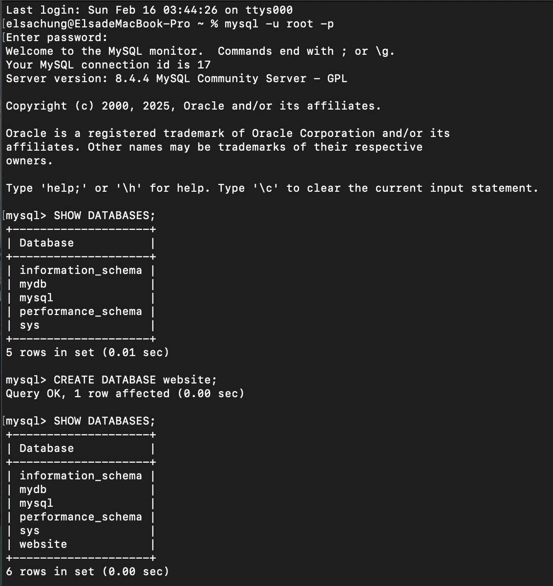

2. USE website;
 
CREATE TABLE member(  
    id BIGINT PRIMARY KEY AUTO_INCREMENT COMMENT 'Unique ID',  
    name VARCHAR(255) NOT NULL COMMENT 'Name',  
    username VARCHAR(255) NOT NULL COMMENT 'Username',  
    password VARCHAR(255) NOT NULL COMMENT 'Password',  
    follower_count INT UNSIGNED NOT NULL DEFAULT 0 COMMENT 'Follower Count',  
    time DATETIME NOT NULL DEFAULT CURRENT_TIMESTAMP COMMENT 'Signup Time'  
);  

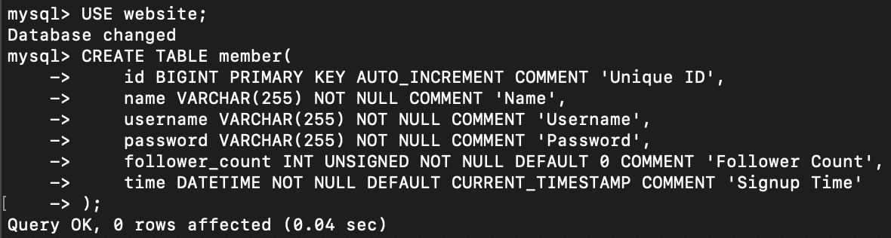   

## Task 3
1.
INSERT INTO member(name, username, password) VALUES('test', 'test', 'test');  
INSERT INTO member(name, username, password, follower_count) VALUES('andy', 'andya', '12', 1);  
INSERT INTO member(name, username, password, follower_count) VALUES('bill', 'billb', '34', 2);  
INSERT INTO member(name, username, password, follower_count) VALUES('calvin', 'calvinc', '56', 3);  
INSERT INTO member(name, username, password, follower_count) VALUES('dan', 'dand', '78', 4);  

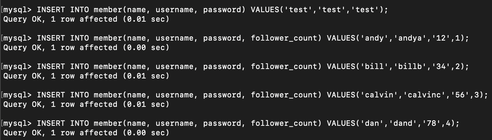   

2. SELECT * FROM member;  

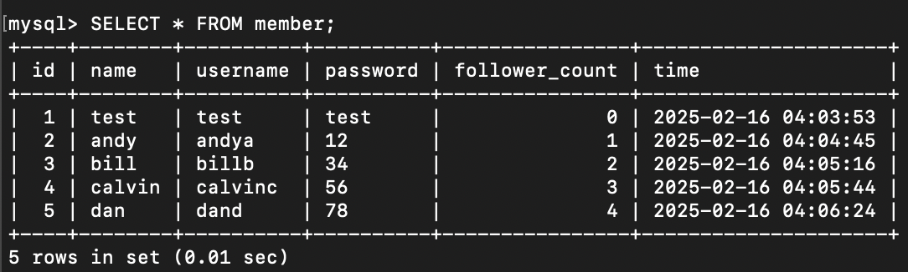   

3. SELECT * FROM member ORDER BY time DESC;  

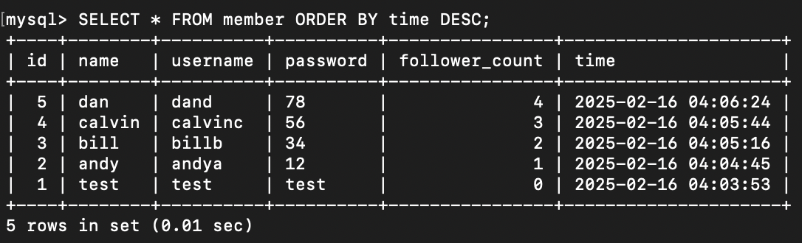   

4. SELECT * FROM member ORDER BY time DESC LIMIT 3 OFFSET 1;  

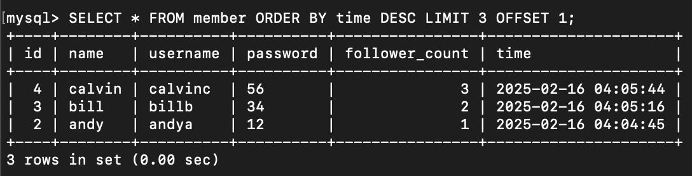   

5. SELECT * FROM member WHERE username= 'test';  

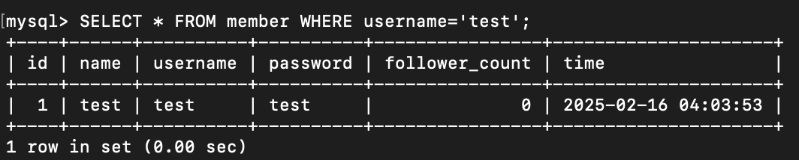   

6. SELECT * FROM member WHERE name LIKE '%es%';  

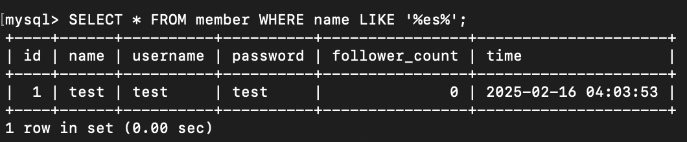   

7. SELECT * FROM member WHERE username= binary 'test' and password= binary 'test';  

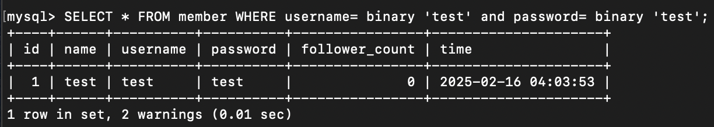   

8. UPDATE member SET name= 'test2' WHERE username= 'test';  

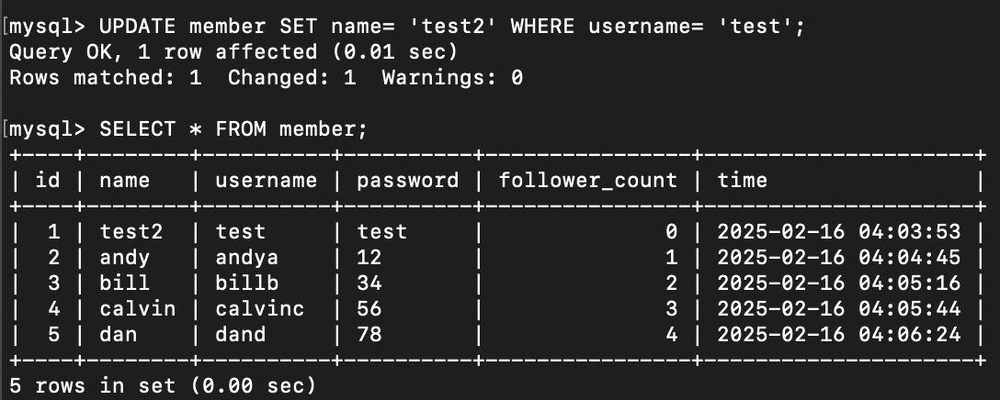   

## Task 4
1. SELECT COUNT(*) FROM member;  

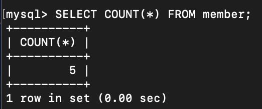  

2. SELECT SUM(follower_count) FROM member;  

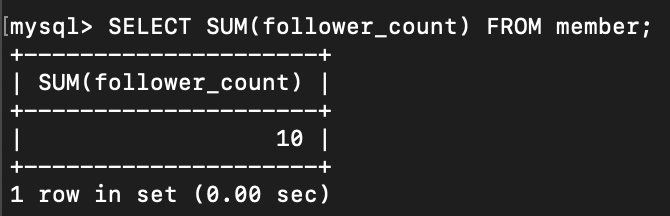  

3. SELECT AVG(follower_count) FROM member;  

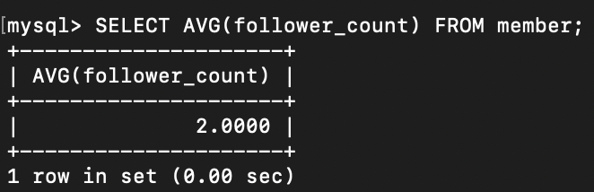  

4. SELECT AVG(follower_count) FROM (SELECT follower_count FROM member ORDER BY follower_count DESC LIMIT 2) AS member_first2;  

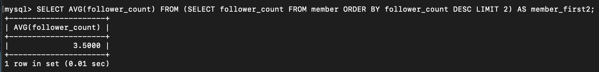  

## Task 5
1. USE website;  

CREATE TABLE message(  
    id BIGINT PRIMARY KEY AUTO_INCREMENT COMMENT 'Unique ID',  
    member_id BIGINT NOT NULL COMMENT 'Member ID for Message Sender',  
    content VARCHAR(255) NOT NULL COMMENT 'Content',  
    like_count INT UNSIGNED NOT NULL DEFAULT 0 COMMENT 'Like Count',  
    time DATETIME NOT NULL DEFAULT CURRENT_TIMESTAMP COMMENT 'Publish Time',  
    FOREIGN KEY(member_id) REFERENCES member(id)  
);  

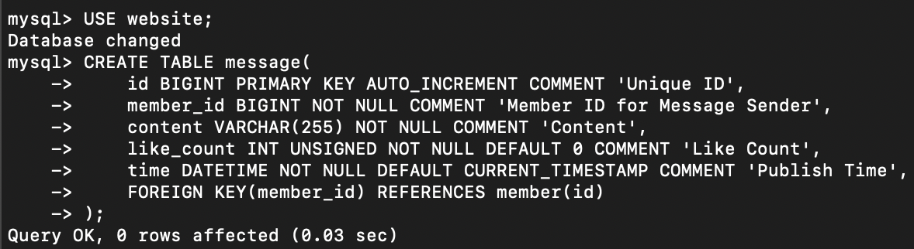   

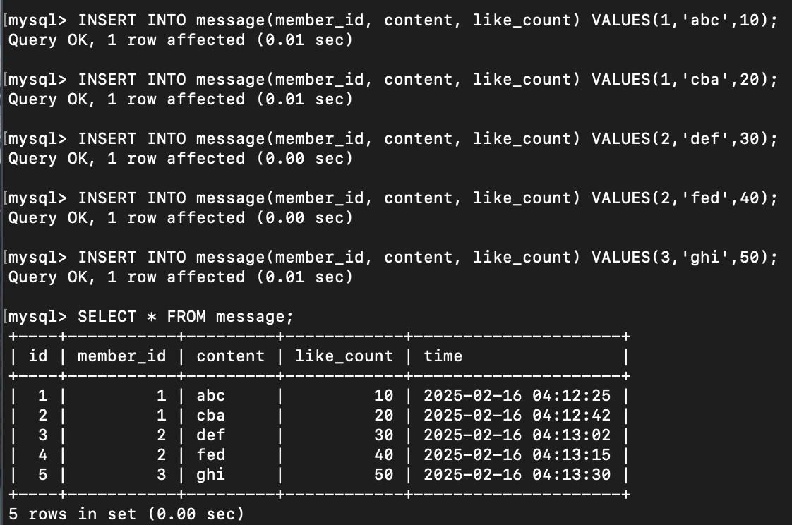   

2. SELECT message.*, member.name FROM member INNER JOIN message ON member.id=message.member_id;  

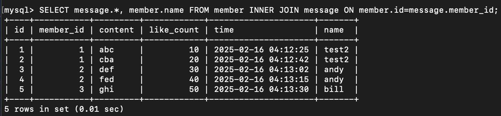   

3. SELECT message.*, member.name FROM member INNER JOIN message ON member.id=message.member_id WHERE member.username='test';  

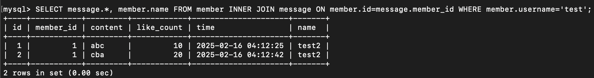   

4. SELECT AVG(message.like_count) FROM message INNER JOIN member ON message.member_id=member.id WHERE member.username='test';  

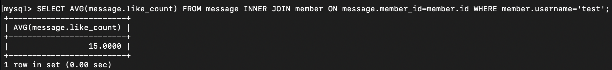   

5. SELECT member.username, AVG(message.like_count) FROM message INNER JOIN member ON message.member_id=member.id GROUP BY member.username;  

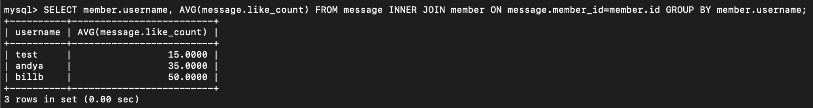   

